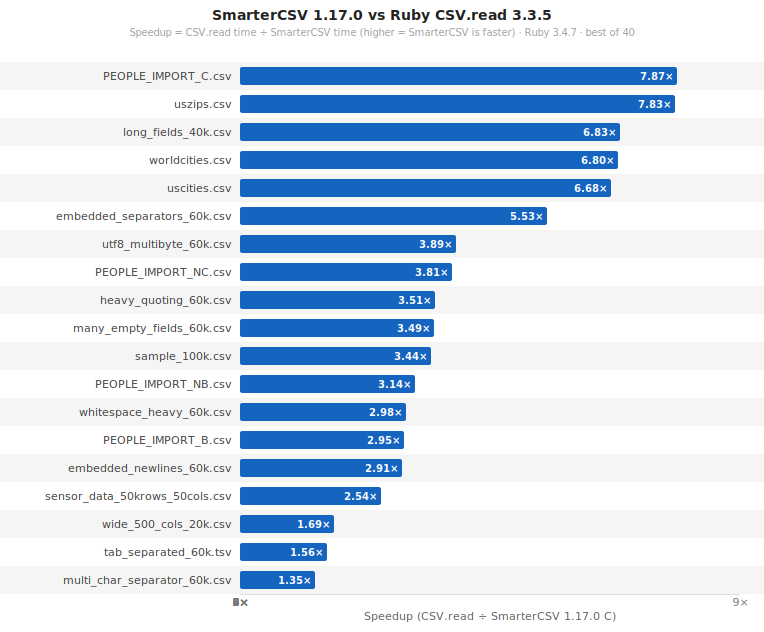
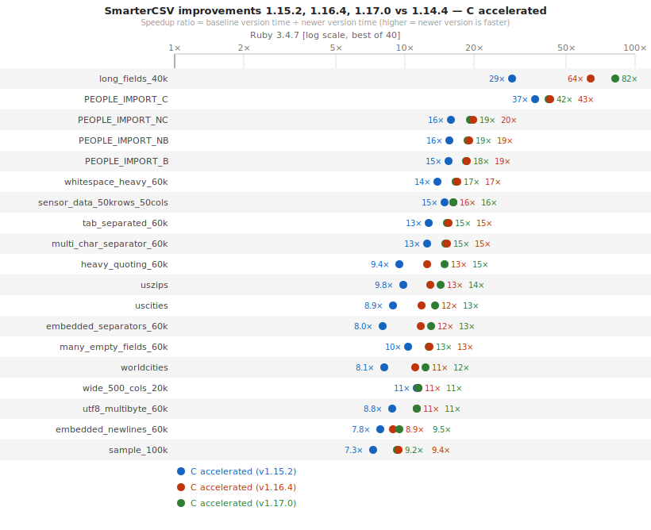
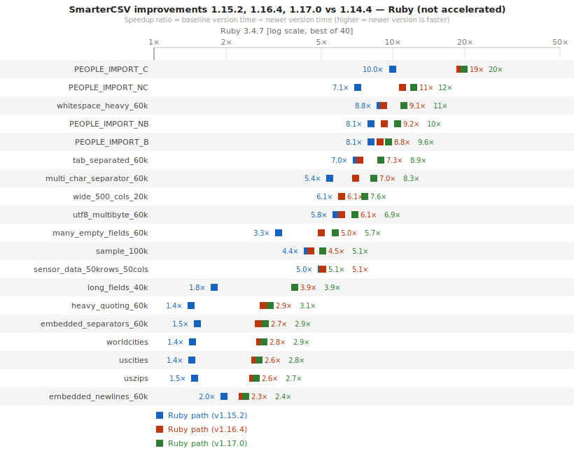

# SmarterCSV

 [](https://codecov.io/gh/tilo/smarter_csv) [](https://rubygems.org/gems/smarter_csv) [](https://rubygems.org/gems/smarter_csv) [](https://www.ruby-toolbox.com/projects/smarter_csv) [](https://tilo.github.io/smarter_csv/upgrade_wizard.html)

> [!TIP]
> **Upgrading from an older version?** Use the [SmarterCSV Upgrade Wizard](https://tilo.github.io/smarter_csv/upgrade_wizard.html) to walk through what (if anything) you need to change for your specific version. Most steps do not require any changes.
        
  SmarterCSV is a high-performance CSV ingestion and generation for Ruby, focused on fast end-to-end CSV ingestion of real-world data — no silent failures, no surprises, not just tokenization.

  ⭐ If SmarterCSV saved you hours of import time, please star the repo, and consider sponsoring this project.

  Ruby's built-in CSV library has 10 documented failure modes that can silently corrupt or lose data — duplicate headers, blank header cells, extra columns, BOMs, whitespace, encoding issues, and more — all without raising an exception.
  SmarterCSV handles 8 our of 10 by default, and the remaining 2 with a single option each.

  > See [**Ruby CSV Pitfalls**](docs/ruby_csv_pitfalls.md) for 10 ways `CSV.read` silently corrupts or loses data, and how SmarterCSV handles them.

  Beyond raw speed, SmarterCSV is designed to provide a significantly more convenient and developer-friendly interface than traditional CSV libraries. Instead of returning raw arrays that require substantial post-processing, SmarterCSV produces Rails-ready hashes for each row, making the data immediately usable with ActiveRecord, Sidekiq pipelines, parallel processing, and JSON-based workflows such as S3.

  In a Rails app, warnings auto-route through `Rails.logger` and instrumentation hooks compose with `ActiveSupport::Notifications` — no setup required. Outside Rails, warnings fall back to `$stderr` and the same APIs work without any framework dependency.

  The library includes intelligent defaults, automatic detection of column and row separators, and flexible header/value transformations. These features eliminate much of the boilerplate typically required when working with CSV data and help keep ingestion code concise and maintainable.

  For large files, SmarterCSV supports both chunked processing (arrays of hashes) and streaming via Enumerable APIs, enabling efficient batch jobs and low-memory pipelines.
  As of 1.17.0, SmarterCSV also accepts **non-seekable streaming inputs** — pipes, `STDIN`, `Zlib::GzipReader`, and HTTP responses — with no need to materialize the file on disk first.
  The C acceleration further optimizes the full ingestion path — including parsing, hash construction, and conversions — so performance gains reflect real-world workloads, not just tokenizer benchmarks.

  The interface is intentionally designed to robustly handle messy real-world CSV while keeping application code clean. Developers can easily map headers, skip unwanted rows, quarantine problematic data, and transform values on the fly without building custom post-processing pipelines. See [Real-World CSV Files](docs/real_world_csv.md) for a comprehensive guide to production CSV patterns.

  When exporting data, SmarterCSV converts arrays of hashes back into properly formatted CSV, maintaining the same focus on convenience and correctness.

**User Testimonial:**
  > "Best gem for CSV for us yet. […] taking an import process from 7+ hours to about 3 minutes. […] SmarterCSV was a big part and helped clean up our code A LOT."

## Performance

SmarterCSV is designed for **real-world CSV processing**, returning fully usable hashes with symbol keys and type conversions — not raw arrays that require additional post-processing.

**Beware of benchmarks that only measure raw CSV parsing.** Such comparisons measure tokenization alone, while real-world usage requires hash construction, key normalization, type conversion, and edge-case handling. Omitting this work **understates the actual cost of CSV ingestion**.

For a fair comparison, `CSV.table` is the closest Ruby CSV equivalent to SmarterCSV.

| Comparison (SmarterCSV 1.17.0, C-accelerated)  | Range                   |
|-------------------------------------------------|-------------------------|
| vs SmarterCSV 1.15.2 (with C acceleration)      | up to 2.8× faster       |
| vs SmarterCSV 1.14.4 (with C acceleration)      | 9×–82× faster           |
| vs SmarterCSV 1.14.4 (Ruby path)                | 2.4×–19.8× faster       |
| vs CSV.read  (arrays of arrays)                 | 1.3×–7.9× faster        |
| vs CSV.table (arrays of hashes)                 | 4.9×–132× faster        |
| vs ZSV 1.3.0 (arrays of hashes, equiv. output)  | 1.1×–6.6× faster †      |

† SmarterCSV faster on 15 of 16 files. ZSV raw arrays (no hashes, no conversions) are 2×–14× faster — but that omits the post-processing work needed to produce usable output. ZSV row carried over from the 1.16.0 benchmark; not re-measured for 1.17.0.

_Benchmarks: 19 CSV files (20k–240k rows), Ruby 3.4.7, Apple M4._

> ⁉️ **Why these numbers look a touch lower than 1.16.0 charts?**
> TL;DR: because we use different statistic methods.
>
> Earlier versions of these benchmarks reported the best-of-N sample (the absolute `min` / fastest run) for each measurement. A single lucky run — empty caches lining up, no scheduler interrupts — could shave up to ~10% off and become the headline number. I think that would be misleading.
> Because of that, we've switched to the 10th-percentile (`p10`) of multiple runs of 40 samples, which discards roughly the four luckiest runs and reports a time much closer to what you'll actually observe in production. On noisier fixtures `p10` is ~5–10% above `min`; on quiet ones it's within 1%. The relative ordering between versions and adapters is unchanged; the absolute speedup figures are simply more honest.

### SmarterCSV vs Ruby CSV


### SmarterCSV C Path


### SmarterCSV Ruby Path


See [SmarterCSV 1.15.2: Faster Than Raw CSV Arrays](https://tilo-sloboda.medium.com/smartercsv-1-15-2-faster-than-raw-csv-arrays-benchmarks-zsv-and-the-full-pipeline-2c12a798032e) and [PR #319](https://github.com/tilo/smarter_csv/pull/319) for more details.


## Switching from Ruby CSV?

It's a one-line change:

```ruby
# Before
rows = CSV.table('data.csv').map(&:to_h)

# After — up to 132× faster, same symbol keys
rows = SmarterCSV.process('data.csv')
```

`SmarterCSV.parse(string)` works like `CSV.parse(string, headers: true, header_converters: :symbol)` — with numeric conversion included by default:

```ruby
data = SmarterCSV.parse(csv_string)
```

* See [**Migrating from Ruby CSV**](docs/migrating_from_csv.md) for a full comparison of options, behavior differences, and a quick-reference table.

## Examples

### Simple Example:

SmarterCSV is designed for robustness — real-world CSV data often has inconsistent formatting, extra whitespace, and varied column separators. Its intelligent defaults automatically clean and normalize data, returning high-quality hashes ready for direct use with ActiveRecord, Sidekiq, or any data pipeline — no post-processing required. See [Parsing CSV Files in Ruby with SmarterCSV](https://tilo-sloboda.medium.com/parsing-csv-files-in-ruby-with-smartercsv-6ce66fb6cf38) for more background.

```ruby
$ cat spec/fixtures/sample.csv
   First Name  , Last	 Name , Emoji , Posts
José ,Corüazón, ❤️, 12
Jürgen, Müller ,😐,3
 Michael, May ,😞, 7

$ irb
>> require 'smarter_csv'
=> true
>> data = SmarterCSV.process('spec/fixtures/sample.csv')
=> [{:first_name=>"José", :last_name=>"Corüazón", :emoji=>"❤️", :posts=>12},
    {:first_name=>"Jürgen", :last_name=>"Müller", :emoji=>"😐", :posts=>3},
    {:first_name=>"Michael", :last_name=>"May", :emoji=>"😞", :posts=>7}]
```
Notice how SmarterCSV automatically (all defaults):
- Normalizes headers → `downcase_header: true`, `strings_as_keys: false`
- Strips whitespace → `strip_whitespace: true`
- Converts numbers → `convert_values_to_numeric: true`
- Removes empty values → `remove_empty_values: true`
- Preserves Unicode and emoji characters

### Header Transformation Pipeline

Once the header line is read, SmarterCSV normalizes it through these steps:

```
comment_regexp → strip_chars_from_headers → split on col_sep → strip quote_char
    → strip_whitespace → [gsub spaces/dashes→_ → downcase_header]
    → disambiguate_headers → symbolize → key_mapping
```

`user_provided_headers` bypasses all of the above. Each step is individually configurable. See [Header Transformations](docs/header_transformations.md) for the full step-by-step table and options.

### Value Transformation Pipeline

After each row is parsed, SmarterCSV applies a transformation pipeline to field values:

```
strip_whitespace → nil_values_matching → remove_empty_values → remove_zero_values
    → convert_values_to_numeric → value_converters → remove_empty_hashes
```

Each step is individually configurable. See [Data Transformations](docs/data_transformations.md) and [Value Converters](docs/value_converters.md) for details.

### Value Converters

Per-column lambdas convert raw strings into typed values — dates, currency, booleans:

```ruby
require 'date'

data = SmarterCSV.process('orders.csv',
  value_converters: {
    dob:    ->(v) { v && Date.strptime(v, '%m/%d/%Y') },
    price:  ->(v) { v&.delete('$,')&.to_f },
    active: ->(v) { v&.match?(/\Atrue\z/i) },
  })
```

See [Value Converters](docs/value_converters.md).

### Batch Processing:

Processing large CSV files in chunks minimizes memory usage and enables powerful workflows:
- **Database imports** — bulk insert records in batches for better performance
- **Parallel processing** — distribute chunks across Sidekiq, Resque, or other background workers
- **Progress tracking** — the optional `chunk_index` parameter enables progress reporting
- **Memory efficiency** — only one chunk is held in memory at a time, regardless of file size

The block receives a `chunk` (array of hashes) and an optional `chunk_index` (0-based sequence number):

```ruby
# Database bulk import
SmarterCSV.process(filename, chunk_size: 100) do |chunk, chunk_index|
  puts "Processing chunk #{chunk_index}..."
  MyModel.insert_all(chunk)  # chunk is an array of hashes
end

# Parallel processing with Sidekiq
SmarterCSV.process(filename, chunk_size: 100) do |chunk|
  Sidekiq::Client.push_bulk('class' => MyWorker, 'args' => chunk) # each chunk processed in parallel
end
```

See [Batch Processing](docs/batch_processing.md) for chunk sizing, `each_chunk`, and parallel-worker patterns.

### Modern Enumerator API:

`Reader#each` is the modern, idiomatic way to process rows — `Reader` includes `Enumerable`, so all standard Ruby methods work:

```ruby
reader = SmarterCSV::Reader.new('data.csv', options)
reader.each { |hash| MyModel.upsert(hash) }

# Enumerable methods
active = reader.select { |h| h[:status] == 'active' }
names  = reader.map    { |h| h[:name] }

# Lazy — stop early without reading the whole file
first_ten = reader.lazy.select { |h| h[:active] }.first(10)

# Manual batching without chunk_size
reader.each_slice(500) { |batch| MyModel.insert_all(batch) }
```

See [The Basic Read API](docs/basic_read_api.md) for the full `Reader` interface.

### Streaming / Non-Seekable Inputs (1.17.0+):

SmarterCSV reads directly from any IO — no need to materialize the file on disk first. Auto-detection works on streaming inputs without rewinding; the first chunk is buffered transparently.

```ruby
# Gzipped CSV — stream-decompressed, never written to disk
require 'zlib'
Zlib::GzipReader.open('huge.csv.gz') do |io|
  SmarterCSV.process(io) { |row| MyModel.upsert(row.first) }
end

# STDIN / pipes
SmarterCSV.process($stdin) { |row, _| ... }

# HTTP response body
require 'open-uri'
URI.open('https://example.com/data.csv') { |io| SmarterCSV.process(io) }
```

See [Row and Column Separators](docs/row_col_sep.md) for how `:auto` detection works on non-seekable streams, and [Configuration Options](docs/options.md) for `buffer_size` (the peek-buffer chunk size).

### Bad Row Handling:

SmarterCSV can quarantine malformed rows instead of crashing the entire import:

```ruby
reader = SmarterCSV::Reader.new('data.csv', on_bad_row: :collect)
good_rows = reader.process

puts "#{good_rows.size} imported, #{reader.errors[:bad_rows].size} bad rows"
reader.errors[:bad_rows].each do |rec|
  puts "Line #{rec[:file_line_number]}: #{rec[:error_message]}"
end
```

See [Bad Row Quarantine](docs/bad_row_quarantine.md) for full details including `bad_row_limit` and `field_size_limit`.

### Header Validation:

Raise early if the file is missing required columns, before any data row is processed:

```ruby
begin
  SmarterCSV.process('transactions.csv',
    required_keys: [:account_id, :amount, :currency])
rescue SmarterCSV::MissingKeys => e
  abort "CSV missing columns: #{e.keys.join(', ')}"
end
```

See [Header Validations](docs/header_validations.md).

### Writing CSV:

```ruby
SmarterCSV.generate('output.csv') do |csv|
  csv << { name: 'Alice', age: 30, city: 'New York' }
  csv << { name: 'Bob',   age: 25, city: 'Chicago'  }
end
```

Hashes (not arrays) make column-shift bugs impossible — adding a column never silently misaligns existing rows. See [The Basic Write API](docs/basic_write_api.md) for header renaming, value converters, and ordered output.

See [18 Examples](docs/examples.md) for more, including encoding and preamble handling, key mapping, instrumentation hooks, and resumable Rails ActiveJob imports.

## Requirements

**Minimum Ruby Version:** >= 2.6

**C Extension:** SmarterCSV includes a native C extension for accelerated CSV parsing.
The C extension is automatically compiled on MRI Ruby. For JRuby and TruffleRuby, SmarterCSV falls back to a pure Ruby implementation.

## Installation

Add this line to your application's Gemfile:
```ruby
    gem 'smarter_csv'
```
And then execute:
```ruby
    $ bundle
```
Or install it yourself as:
```ruby
    $ gem install smarter_csv
```

## Documentation

  * [Introduction](docs/_introduction.md)
  * [**Migrating from Ruby CSV**](docs/migrating_from_csv.md)
  * [Ruby CSV Pitfalls](docs/ruby_csv_pitfalls.md)
  * [Parsing Strategy](docs/parsing_strategy.md)
  * [The Basic Read API](docs/basic_read_api.md)
  * [The Basic Write API](docs/basic_write_api.md)
  * [Batch Processing](docs/batch_processing.md)
  * [Configuration Options](docs/options.md)
  * [Row and Column Separators](docs/row_col_sep.md)
  * [Header Transformations](docs/header_transformations.md)
  * [Header Validations](docs/header_validations.md)
  * [Column Selection](docs/column_selection.md)
  * [Data Transformations](docs/data_transformations.md)
  * [Value Converters](docs/value_converters.md)
  * [Bad Row Quarantine](docs/bad_row_quarantine.md)
  * [Warnings](docs/warnings.md)
  * [Instrumentation Hooks](docs/instrumentation.md)
  * [Examples](docs/examples.md)
  * [Real-World CSV Files](docs/real_world_csv.md)
  * [SmarterCSV over the Years](docs/history.md)
  * [Release Notes](docs/releases/1.17.0/changes.md)

## Articles
  * [Parsing CSV Files in Ruby with SmarterCSV](https://tilo-sloboda.medium.com/parsing-csv-files-in-ruby-with-smartercsv-6ce66fb6cf38)
  * [CSV Writing with SmarterCSV](https://tilo-sloboda.medium.com/csv-writing-with-smartercsv-26136d47ad0c)
  * [Processing 1.4 Million CSV Records in Ruby, fast ](https://lcx.wien/blog/processing-14-million-csv-records-in-ruby/)
  * [Faster Parsing CSV with Parallel Processing](http://xjlin0.github.io/tech/2015/05/25/faster-parsing-csv-with-parallel-processing) by [Jack lin](https://github.com/xjlin0/)
  * The original [Stackoverflow Question](https://stackoverflow.com/questions/7788618/update-mongodb-with-array-from-csv-join-table/7788746#7788746) that inspired SmarterCSV
  * [The original post](http://www.unixgods.org/Ruby/process_csv_as_hashes.html) for SmarterCSV
  * [SmarterCSV over the Years](docs/history.md) — version timeline and performance journey (9×–65× faster than v1.14.4)

# [ChangeLog](./CHANGELOG.md)

## Reporting Bugs / Feature Requests

Please [open an Issue on GitHub](https://github.com/tilo/smarter_csv/issues) if you have feedback, new feature requests, or want to report a bug. Thank you!

For reporting issues, please:
  * include a small sample CSV file
  * open a pull-request adding a test that demonstrates the issue
  * mention your version of SmarterCSV, Ruby, Rails

# [A Special Thanks to all 64 Contributors!](CONTRIBUTORS.md) 🎉🎉🎉


## Contributing

1. Fork it
2. Create your feature branch (`git checkout -b my-new-feature`)
3. Commit your changes (`git commit -am 'Added some feature'`)
4. Push to the branch (`git push origin my-new-feature`)
5. Create new Pull Request

