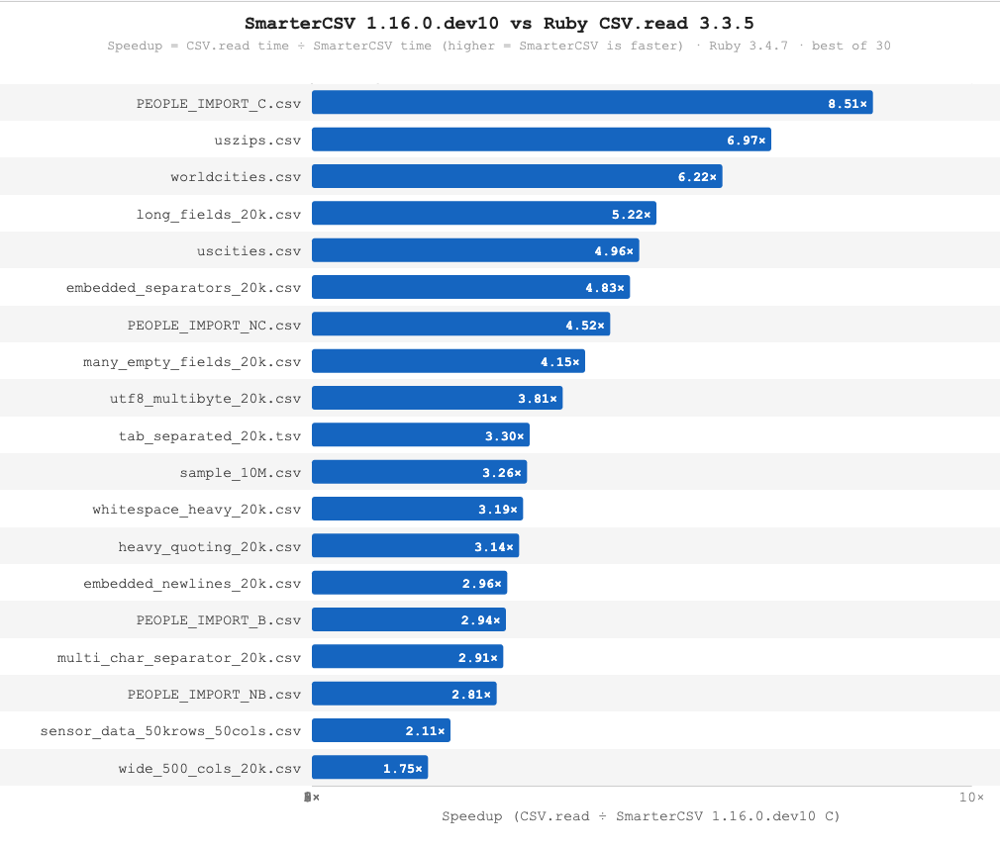

### Contents

  * [**Introduction**](./_introduction.md)
  * [Migrating from Ruby CSV](./migrating_from_csv.md)
  * [Ruby CSV Pitfalls](./ruby_csv_pitfalls.md)
  * [Parsing Strategy](./parsing_strategy.md)
  * [The Basic Read API](./basic_read_api.md)
  * [The Basic Write API](./basic_write_api.md)
  * [Batch Processing](././batch_processing.md)
  * [Configuration Options](./options.md)
  * [Row and Column Separators](./row_col_sep.md)
  * [Header Transformations](./header_transformations.md)
  * [Header Validations](./header_validations.md)
  * [Column Selection](./column_selection.md)
  * [Data Transformations](./data_transformations.md)
  * [Value Converters](./value_converters.md)
  * [Bad Row Quarantine](./bad_row_quarantine.md)
  * [Warnings](./warnings.md)
  * [Instrumentation Hooks](./instrumentation.md)
  * [Examples](./examples.md)
  * [Real-World CSV Files](./real_world_csv.md)
  * [SmarterCSV over the Years](./history.md)
  * [Release Notes](./releases/1.16.0/changes.md)

--------------

# SmarterCSV Introduction

`smarter_csv` is a Ruby gem for fast & convenient importing and exporting of CSV files. It has intelligent defaults and auto-discovery of column and row separators. Importing returns Rails-ready hashes — suitable for direct use with ActiveRecord, Sidekiq, parallel processing, or S3 workflows. Exporting takes hashes or arrays of hashes and writes properly formatted CSV.

## Why another CSV library?

**Inconvenient.** Ruby's built-in `csv` library returns arrays of arrays, which means your application code must handle column indexing, header normalization, type conversion, and whitespace stripping manually. It also has no built-in support for chunked or parallel processing of large files.

**Hidden failure modes.** `CSV.read` has 10 ways to silently corrupt or lose data — no exception, no warning, no log line. Duplicate headers, blank header cells, extra columns, BOMs, whitespace, inconsistent empty-field representation, runaway quoted fields, and encoding issues all fail silently. See [Ruby CSV Pitfalls](./ruby_csv_pitfalls.md) for reproducible examples and the SmarterCSV fix for each.

**Slow.** On top of everything else, it is up to 129× slower than SmarterCSV for equivalent end-to-end work.



SmarterCSV was created to solve exactly these problems: nightly imports of large datasets that needed to be upserted into a database, processed in parallel, and remain robust against real-world variations in input data.

## Benefits of using SmarterCSV

* **Performance:**
  SmarterCSV's C extension accelerates the full ingestion pipeline — parsing, hash construction, and value conversions — not just tokenization. Real-world benchmarks against `CSV.table` (the closest equivalent) show 7×–129× faster end-to-end throughput.

* **Rails-ready output:**
  Each CSV row is returned as a Ruby hash with symbol keys, numeric conversion, and whitespace stripping applied automatically. No post-processing boilerplate needed — records can be passed directly to `ActiveRecord`, `insert_all`, Sidekiq, message queues, or JSON serializers.

* **Intelligent defaults and robustness:**
  SmarterCSV auto-detects row and column separators, handles BOMs, strips extra whitespace, and tolerates common real-world inconsistencies — all without manual configuration. This makes imports robust against data you don't fully control, such as user-uploaded files or third-party exports.

* **Flexible header and value transformations:**
  Headers are automatically downcased, symbolized, and normalized. You can remap or drop columns with `key_mapping`, override headers entirely with `user_provided_headers`, and apply per-field value converters for custom type coercion (dates, booleans, currency, etc.).

* **Batch and streaming processing:**
  `chunk_size` enables memory-efficient batch processing of arbitrarily large files — each chunk is an array of hashes ready for `insert_all`, Sidekiq, or other data sinks. The `Reader#each` enumerator includes `Enumerable`, giving you lazy evaluation, `each_slice`, `select`, `map`, and more.

* **Bad row quarantine:**
  Malformed rows can be collected or skipped instead of crashing the entire import. `on_bad_row: :collect` lets you inspect and log bad rows after processing completes.

## Additional Features

* **Header validation:**
  Use `required_keys` to raise an error before any data rows are processed if expected columns are missing. Works with post-transformation key names, so it's safe to combine with `key_mapping`. See [Header Validations](./header_validations.md).

* **Instrumentation hooks:**
  `on_start`, `on_chunk`, and `on_complete` callbacks give you visibility into import progress — useful for logging, progress bars, and alerting in long-running jobs. See [Instrumentation Hooks](./instrumentation.md).

* **Resumable imports:**
  The `chunk_index` parameter pairs naturally with Rails 8.1's `ActiveJob::Continuable` for jobs that can pause and resume mid-import without reprocessing already-completed chunks. See [Examples](./examples.md#example-12-resumable-csv-import-with-rails-activejob-rails-81).

* **CSV writing:**
  `SmarterCSV.generate` writes arrays of hashes to CSV, with support for header renaming and value converters on output. See [The Basic Write API](./basic_write_api.md).

## Build-Time Performance Tuning (`SMARTER_CSV_PERFORMANCE`)

The C extension is compiled when the gem is installed. By default it is built **portable**: it uses no CPU-specific instructions, so a binary compiled on one machine runs on any other CPU of the same architecture. This matters whenever the machine that builds the gem differs from the machine that runs it — a CI or build server, a Docker image moved between hosts, or a mixed-hardware fleet. A build that bakes in instructions the run host lacks (such as AVX-512) would otherwise crash with `Illegal instruction`.

Set `SMARTER_CSV_PERFORMANCE` at install time to trade portability for speed:

| Level                | Flags added                               | Portable?                        | Use when                              |
|----------------------|-------------------------------------------|----------------------------------|---------------------------------------|
| `portable` (default) | none                                      | Yes, any CPU of the arch         | Build host may differ from run host   |
| `tuned`              | `-mtune=native`                           | Yes, instruction scheduling only | Build and run hosts share a microarch |
| `max`                | `-march=native`, or `-mcpu=native` on ARM | No, host instruction optimization| Build host and run host are the same  |

`tuned` only changes instruction scheduling, never the instruction set, so it stays portable — and it pays off when the build and run hosts share a microarchitecture (the same chip, or a fleet of identical instances). `max` enables host-specific instructions and is the fastest, but a binary built with it can crash on a different CPU. Every flag is probed against your compiler at build time and skipped if unsupported, so an unavailable flag never breaks the build.

```bash
SMARTER_CSV_PERFORMANCE=tuned gem install smarter_csv   # portable, tuned for this machine's microarchitecture
SMARTER_CSV_PERFORMANCE=max   gem install smarter_csv   # fastest, NOT portable — only when you build on the machine you run on
SMARTER_CSV_PERFORMANCE=tuned bundle install            # same, under Bundler
```

For a fixed baseline instead of `native` (e.g. a portable-but-newer instruction set), pass flags directly via `CFLAGS`, which the build also honors: `CFLAGS="-march=x86-64-v2" gem install smarter_csv`.

---------------

NEXT: [Migrating from Ruby CSV](./migrating_from_csv.md) | UP: [README](../README.md)
